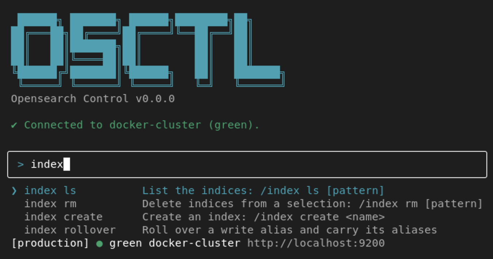

<div align="center">

[](https://github.com/jboix/osctl)
[](https://github.com/jboix/osctl/actions/workflows/quality.yml)
[](https://www.npmjs.com/package/osctl)
[](https://nodejs.org)
[](./LICENSE)

</div>

# OSCTL

osctl is an interactive terminal interface, built with [Ink](https://github.com/vadimdemedes/ink),
for managing OpenSearch clusters. It is an alternative to curl and the REST API for routine
administration. It also removes some ceremony, like resolving `seq_no` and `primary_term` on policy
updates and carrying aliases over a rollover.

## Quick start

Install with npm (Node 20 or later):

```bash
npm install -g osctl
```

Or run it once without installing:

```bash
npx osctl
```

Standalone binaries are also available. The installation script keeps versions side by side and 
points a `current` symlink at the active one; run it again to update, or with `-v <version>` to pin
or roll back:

```bash
mkdir -p ~/.osctl && cd ~/.osctl
wget https://raw.githubusercontent.com/jboix/osctl/main/install-osctl.sh
chmod +x install-osctl.sh
./install-osctl.sh
export PATH="$HOME/.osctl/current:$PATH"
```

Then start osctl and connect to a cluster:

```bash
osctl
> /profile add
```

## Commands

| Family      | Commands                               |
|-------------|----------------------------------------|
| `/index`    | `ls`, `create`, `rm`, `rollover`       |
| `/alias`    | `ls`, `apply`, `rm`                    |
| `/template` | `ls`, `show`, `apply`, `rm`            |
| `/policy`   | `ls`, `show`, `apply`, `rm`, `explain` |
| `/cluster`  | `info`                                 |
| `/profile`  | `add`, `ls`, `default`, `rm`           |

> [!TIP]
> Listings and removals accept glob patterns: `/index ls core_*`.

See [docs/design/commands.md](docs/design/commands.md) for the arguments, behavior, and
backing API of each command.

## Contributing

See the [contributing guide](docs/CONTRIBUTING.md). Participation is governed by the
[Code of Conduct](docs/CODE_OF_CONDUCT.md).

## License

MIT, see [LICENSE](LICENSE).
